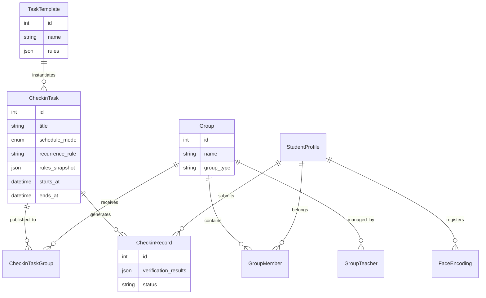
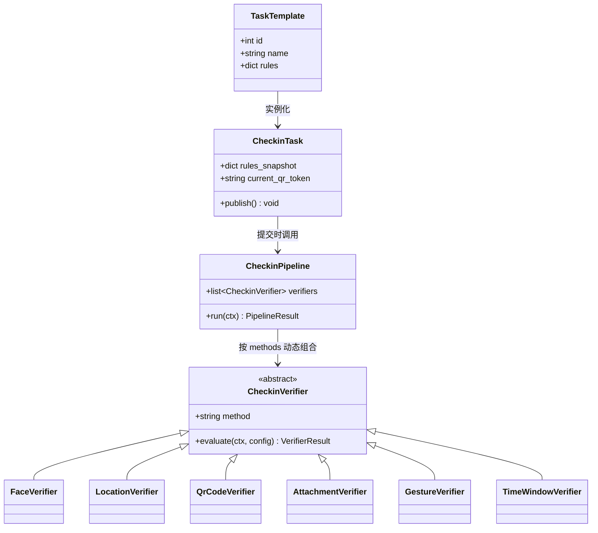
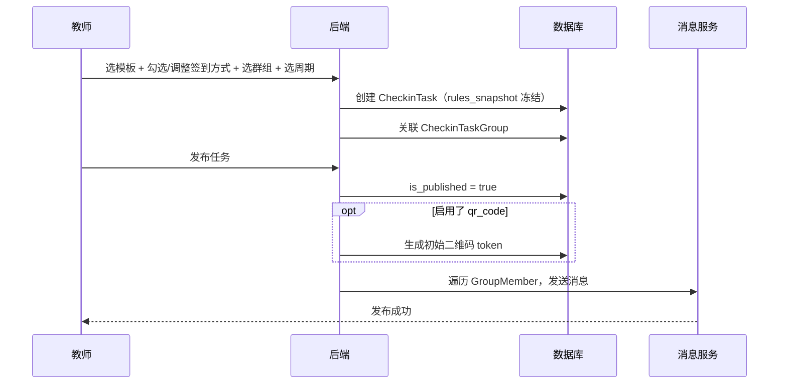
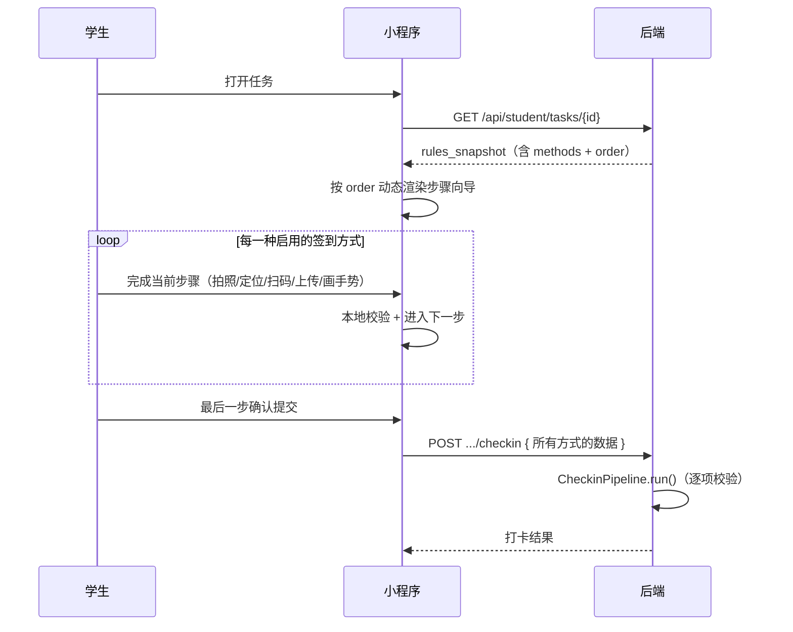

# 打卡任务系统设计方案（班级群组 + 模板模式 + 可组合签到方式）

> 版本：v1.2  
> 日期：2026-06-26  
> 状态：设计稿（待评审）

---

## 1. 背景与问题

### 1.1 当前实现的问题

现有实现将 **「查寝打卡 / 课程打卡 / 实习打卡」** 作为系统的顶层分类（`checkin_types`），并在 seed 数据、前端展示、业务逻辑中分别建模。这种分级方式是 **错误的**。

**本质事实：**

- 不管是寝室、课程还是实习，业务形态完全一致：**教师向一个班级群组发布打卡任务 → 群内学生收到通知 → 按规则完成打卡**。
- 「查寝 / 课程 / 实习」只是 **班级名称或模板名称的业务标签**，不应驱动不同的代码分支。
- 差异应体现在 **模板配置**（时间窗口、启用哪些签到方式及其参数），而非独立的业务模块。

### 1.2 正确的产品模型（类钉钉）

| 概念 | 说明 |
|------|------|
| **班级群组** | 任务发布与接收的基本单位，如「3号寝室班」「软工导论 A202 班」「XX 公司实习班」 |
| **任务模板** | 教师预设的规则组合，发布任务时选用，可复用 |
| **打卡任务** | 教师基于模板创建并发布到群组的具体实例 |
| **任务周期** | **一次任务**（临时签到）或 **定时任务**（每日/每周循环，教师只设置一次） |
| **签到方式** | 教师 **自由勾选、自由组合** 的验证手段（人脸 / 位置 / 二维码 / 附件 / 手势等） |

---

## 2. 核心设计原则

1. **群组优先**：一切任务以 `Group` 为发布单位，学生通过群组成员关系接收任务。
2. **模板驱动差异**：查寝/课程/实习的差异全部收敛到 `TaskTemplate.rules` 配置，代码不分叉。
3. **签到方式可组合**：教师发布任务时可勾选任意一种或多种签到方式，系统按配置动态组装校验流水线。
4. **一次 vs 循环**：任务周期是任务属性，不是场景属性。
5. **消息触达**：任务发布后对群内学生推送消息（类钉钉通知）。
6. **插件化扩展**：每种签到方式实现为独立的 `CheckinVerifier`，新增方式无需改动核心流程。

---

## 3. 签到方式（可自由选择与组合）

### 3.1 支持的签到方式一览

| 方式 | 标识 | 说明 | 典型场景 |
|------|------|------|----------|
| **人脸识别** | `face` | 摄像头拍照，后端提取 128 维特征并与注册照比对 | 查寝、课程、实习 |
| **地理位置** | `location` | GPS 坐标 + Haversine 地理围栏校验 | 查寝、课程、到场签到 |
| **二维码签到** | `qr_code` | 教师端展示动态二维码，学生扫码后校验 | 课堂签到、防代签、到场确认 |
| **附件上传** | `attachment` | 上传图片/文件/文字日志（如今日实习日报） | 实习日报、情况说明 |
| **手势签到** | `gesture` | 学生在屏幕绘制指定手势图案（或随机手势挑战） | 快速签到、趣味签到 |

> 教师创建任务或选用模板时，通过 **多选框** 勾选需要的签到方式，可单选也可任意组合。  
> 例如：查寝 = 人脸 + 位置；课程 = 二维码 + 人脸；实习 = 人脸 + 位置 + 附件。

### 3.2 组合示例

| 任务场景 | 启用的签到方式 | 组合说明 |
|----------|----------------|----------|
| 晚间查寝 | `face` + `location` | 先人脸核验，再校验是否在宿舍围栏内 |
| 课堂签到 | `qr_code` + `face` | 扫描教师展示的二维码，再拍照人脸 |
| 实习日报 | `face` + `location` + `attachment` | 人脸 + 定位 + 上传工作日志 |
| 快速点名 | `gesture` + `qr_code` | 绘制手势 + 扫二维码，无需 GPS |
| 纯日志提交 | `attachment` | 仅上传文字/图片，无生物/位置校验 |

### 3.3 组合规则

| 规则 | 说明 |
|------|------|
| **至少选一种** | 教师发布任务时必须启用 ≥1 种签到方式 |
| **全部通过才算成功** | 启用的每一种方式都必须校验通过，打卡才算成功 |
| **顺序可配置** | 模板中 `verificationRule.order` 定义各方式的执行顺序（前端向导 + 后端 Pipeline 一致） |
| **单项失败策略** | 默认：该项失败 → 整体异常/待审核；可配置 `allowPartialSubmit` 允许先提交后补审 |
| **互斥（可选）** | 一般不做互斥；若业务需要可在模板层约束（如「手势 OR 人脸」二选一，通过 `mode: "any_one"` 扩展） |

---

## 4. 领域模型

### 4.1 实体关系图



### 4.2 实体说明

#### Group（班级群组）— 核心聚合根

| 字段 | 说明 | 示例 |
|------|------|------|
| `name` | 班级名称 | 「3号寝室班」「软工导论 A202 班」「XX 实习班」 |
| `group_type` | 业务标签（仅展示/筛选，不驱动逻辑） | `dorm` / `course` / `internship` / `custom` |
| `organization_id` | 所属组织 | 软件学院 |

**示例群组：**

```
Group(name="3号寝室班",     group_type="dorm")
Group(name="软工导论A202班", group_type="course")
Group(name="XX公司实习班",   group_type="internship")
```

> `group_type` 仅用于管理端筛选和 UI 展示，**不参与打卡逻辑分支**。

#### TaskTemplate（任务模板）

教师可复用的规则预设。核心配置在 `verificationRule` 中声明 **启用哪些签到方式及其参数**。

```json
{
  "name": "晚间查寝模板",
  "rules": {
    "timeRule": {
      "startTime": "21:30",
      "endTime": "23:00",
      "allowLate": false,
      "allowMakeup": true
    },
    "verificationRule": {
      "methods": ["face", "location"],
      "order": ["face", "location"],
      "face": {
        "tolerance": 0.6,
        "detectionModel": "hog"
      },
      "location": {
        "placeName": "3号宿舍楼",
        "longitude": 120.000001,
        "latitude": 30.000001,
        "radius": 300
      },
      "qr_code": {
        "refreshIntervalSeconds": 60,
        "expireSeconds": 120,
        "allowReuse": false
      },
      "attachment": {
        "required": false,
        "acceptTypes": ["text", "image"],
        "minTextLength": 10,
        "maxFileCount": 3,
        "maxFileSizeMb": 10,
        "label": "情况说明"
      },
      "gesture": {
        "mode": "preset",
        "presetPattern": "Z",
        "tolerance": 0.15,
        "challengeEnabled": false
      }
    },
    "reviewRule": {
      "mode": "exception_only"
    },
    "reminderRule": {
      "beforeStartMinutes": 10,
      "beforeEndMinutes": 5
    }
  }
}
```

#### CheckinTask（打卡任务实例）

| 字段 | 说明 |
|------|------|
| `template_id` | 来源模板（可选） |
| `schedule_mode` | `one_time`（一次任务）或 `recurring`（定时任务） |
| `recurrence_rule` | 循环规则，如 `FREQ=DAILY` |
| `rules_snapshot` | 发布时冻结的规则快照 |
| `group_ids` | 通过 `CheckinTaskGroup` 关联的目标群组 |
| `current_qr_token` | 当前有效二维码载荷（启用 qr_code 时，教师刷新后写入，含签名与过期时间） |

**一次任务 vs 定时任务：**

| 类型 | 教师操作 | 系统行为 | 类比钉钉 |
|------|----------|----------|----------|
| **一次任务** | 设置起止时间，发布一次 | 学生在窗口内打卡一次即完成 | 临时签到 |
| **定时任务** | 设置循环规则 + 每日时间窗口，发布一次 | 每日生成打卡实例，学生每天打卡 | 每日考勤 |

#### CheckinRecord（打卡记录）

每条记录保存 **各签到方式的校验结果**，结构统一：

```json
{
  "verification_results": {
    "time":    { "method": "time",    "passed": true,  "message": "在打卡窗口内" },
    "face":    { "method": "face",    "passed": true,  "distance": 0.35, "message": "人脸验证通过" },
    "location":{ "method": "location","passed": true,  "distance_m": 12.5, "message": "在围栏内" },
    "qr_code": { "method": "qr_code", "passed": true, "message": "二维码校验通过" },
    "attachment":   { "method": "attachment", "passed": true, "file_ids": [1, 2] },
    "gesture": { "method": "gesture", "passed": true, "similarity": 0.92, "message": "手势匹配" }
  },
  "enabled_methods": ["face", "location"],
  "status": "normal",
  "evaluation_messages": []
}
```

> 仅 **模板中启用的方式** 会有对应结果项；未启用的方式不出现在记录中。

---

## 5. 签到方式详细设计

### 5.1 人脸识别（face）

| 项 | 说明 |
|----|------|
| **学生操作** | 打开摄像头拍照 |
| **后端校验** | 提取 128 维特征 → 与 `face_encodings` 表比对（tolerance 默认 0.6） |
| **前置条件** | 学生已录入人脸（管理员/学生自助录入） |
| **配置项** | `tolerance`、`detectionModel`（hog/cnn） |

参考实现：`07-face-recognition.html`

### 5.2 地理位置（location）

| 项 | 说明 |
|----|------|
| **学生操作** | 授权 GPS，获取当前经纬度 |
| **后端校验** | Haversine 公式计算与目标点距离，≤ radius 则通过 |
| **配置项** | `placeName`、`longitude`、`latitude`、`radius`（米） |
| **推荐半径** | 教室 50–100m、宿舍 100–300m、实习单位 150–500m |

参考实现：`10-location-face.html`

### 5.3 二维码签到（qr_code）

> 产品语境中的「动态码」指 **动态刷新的二维码**，学生通过 **扫码** 完成签到，而非手动输入数字/字母码。

| 项 | 说明 |
|----|------|
| **教师操作** | 任务详情页展示二维码（可投屏），支持手动/自动刷新 |
| **学生操作** | 打开小程序「扫一扫」，扫描教师展示的二维码 |
| **后端校验** | 解析二维码 payload（含 `task_id`、`nonce`、`expires_at`）→ 验签 → 校验未过期、未重复使用、任务匹配 |
| **配置项** | `refreshIntervalSeconds`（自动刷新间隔）、`expireSeconds`（单码有效期）、`allowReuse`（是否允许同一码被多人扫，默认 false） |
| **安全** | 二维码内容 JWT/HMAC 签名；过期即失效；刷新后旧码立即作废；可选绑定 `occurrence_date` 防止跨日复用 |

**二维码 Payload 示例：**

```json
{
  "task_id": 12,
  "occurrence_date": "2026-06-26",
  "nonce": "a1b2c3d4",
  "expires_at": 1719400000,
  "sig": "hmac_sha256(...)"
}
```

**交互流程：**

```
教师端（投屏/手机）              学生端（小程序）
┌──────────────────┐            ┌──────────────────┐
│   [QR Code 图片]  │            │   [扫一扫]        │
│   59s 后自动刷新   │  ──扫码──▶│   对准二维码      │
│   [手动刷新]      │            │   校验通过 ✓      │
└──────────────────┘            └──────────────────┘
```

**实现要点：**

- 教师端：调用 `GET /api/teacher/tasks/{id}/qr-code` 获取当前二维码（返回图片 URL 或 base64 + 过期时间）
- 学生端：`uni.scanCode` 扫描 → 将扫码结果提交至 checkin payload 的 `qr_payload` 字段
- 后端：`QrCodeVerifier` 验签 + 校验 TTL + 可选 Redis 记录 `nonce` 防重放

### 5.4 附件上传（attachment）

| 项 | 说明 |
|----|------|
| **学生操作** | 填写文字日志和/或上传图片、文件 |
| **后端校验** | 检查必填、字数下限、文件数量/大小/类型 |
| **配置项** | `required`、`acceptTypes`（text/image/file）、`minTextLength`、`maxFileCount`、`maxFileSizeMb`、`label` |
| **存储** | 文件存 `storage/checkin/{task_id}/{student_id}/`，记录写入 `checkin_record_attachments` |
| **用途** | 实习日报、情况说明、现场照片等 |

> 附件上传是 **签到方式的一种**，与「独立 daily_report 模块」合并：启用 `attachment` 即代表任务要求提交日志/附件。

### 5.5 手势签到（gesture）

| 项 | 说明 |
|----|------|
| **学生操作** | 在屏幕九宫格/画布上绘制手势轨迹 |
| **后端校验** | 将学生轨迹与预设图案做相似度匹配（如 $1 Recognizer 算法） |
| **模式** | `preset`：固定图案（如 Z 形）；`challenge`：系统随机下发图案指令 |
| **配置项** | `mode`、`presetPattern`、`tolerance`（相似度阈值）、`challengeEnabled` |
| **典型场景** | 课堂快速点名、无需 GPS/摄像头的轻量签到 |

```
模式 A：预设手势               模式 B：随机挑战
┌───┬───┬───┐                 系统: "请画一个 N 形"
│ ● │   │   │                 ┌───┬───┬───┐
│   │   │ ● │                 │   │ ● │   │
│   │ ● │   │                 │ ● │   │   │
└───┴───┴───┘                 │   │   │ ● │
  学生绘制 Z 形                 └───┴───┴───┘
```

---

## 6. 校验流水线设计（责任链 + 插件化）

### 6.1 动态组装流水线

Pipeline **不再固定步骤**，而是根据 `verificationRule.methods` 动态构建：

```python
# 伪代码 — 插件化校验流水线

VERIFIER_REGISTRY = {
    "face":         FaceVerifier,
    "location":     LocationVerifier,
    "qr_code":         QrCodeVerifier,
    "attachment":   AttachmentVerifier,
    "gesture":      GestureVerifier,
}


class CheckinVerifier(ABC):
    method: str
    @abstractmethod
    def evaluate(self, ctx: CheckinContext, config: dict) -> VerifierResult: ...


class CheckinPipeline:
    def __init__(self, rules: dict):
        vr = rules["verificationRule"]
        self.verifiers = self._build_verifiers(vr)

    def _build_verifiers(self, vr: dict) -> list[CheckinVerifier]:
        order = vr.get("order", vr["methods"])
        return [
            VERIFIER_REGISTRY[method](vr[method])
            for method in order
            if method in vr["methods"]
        ]

    def run(self, ctx: CheckinContext) -> PipelineResult:
        # 1. 时间窗口（始终校验，不属于可选签到方式）
        time_result = TimeWindowVerifier(rules["timeRule"]).evaluate(ctx)
        if not time_result.passed:
            return PipelineResult.fail(time_result)

        # 2. 按 order 依次执行启用的签到方式
        results = {}
        for verifier in self.verifiers:
            result = verifier.evaluate(ctx)
            results[verifier.method] = result
            if not result.passed:
                break  # 或根据 allowPartialSubmit 决定是否继续

        return PipelineResult.merge(time_result, results)
```

### 6.2 前端：动态步骤向导

小程序打卡页 **根据任务配置动态渲染步骤**，只展示启用的签到方式：

```
任务: 晚间查寝
启用: face + location

┌─────────────────────────────────────┐
│  Step 1/2  人脸核验                  │
│  [摄像头预览]  请正对摄像头            │
│  [拍摄并验证]                         │
└─────────────────────────────────────┘
         ↓ 通过后
┌─────────────────────────────────────┐
│  Step 2/2  位置校验                  │
│  当前位置: 3号宿舍楼附近  ✓ 距12m    │
│  [确认并提交]                         │
└─────────────────────────────────────┘
```

```
任务: 实习日报打卡
启用: face + location + attachment

Step 1/3 人脸 → Step 2/3 位置 → Step 3/3 上传日志
```

```
任务: 课堂快速签到
启用: qr_code + gesture

Step 1/2 扫描二维码 → Step 2/2 绘制手势
```

前端从 `GET /api/student/tasks/{id}` 的 `rules_snapshot.verificationRule` 读取 `methods` 和 `order`，动态生成步骤组件列表。

### 6.3 类图



---

## 7. 模板模式（Template Method Pattern）

### 7.1 为什么用模板模式

三种「场景」的公共流程完全相同，差异仅在 **启用哪些签到方式** 及各方式参数：

| 签到方式 | 查寝模板 | 课程模板 | 实习模板 |
|----------|----------|----------|----------|
| face | ✅ | ✅ | ✅ |
| location | ✅ | ✅ | ✅ |
| qr_code | ❌ | ✅ | ❌ |
| attachment | ❌ | ❌ | ✅ 必填 |
| gesture | ❌ | ❌ | ❌ |
| 时间窗口 | 21:30–23:00 | 08:00–08:15 | 08:30–10:00 |
| 任务周期 | recurring | one_time | recurring |

**代码层面：** 一个 `CheckinPipeline` + 五个 `CheckinVerifier` 插件 + 不同 JSON 配置，零业务分支。

### 7.2 模板与任务的关系

```
TaskTemplate（可复用配方，含 methods 组合）
    │
    │  教师选择模板 → 可微调签到方式 → 选群组 → 选周期
    ▼
CheckinTask（rules_snapshot 冻结）
    │
    │  发布 → 消息通知 GroupMember
    ▼
学生打卡 → CheckinPipeline.run()（仅执行启用的 Verifier）
    │
    ▼
CheckinRecord（verification_results 按启用项写入）
```

---

## 8. 业务流程

### 8.1 教师发布任务



**API 设计：**

```
POST /api/teacher/tasks
{
  "title": "今晚查寝",
  "template_id": 1,
  "group_ids": [1],
  "schedule_mode": "recurring",
  "recurrence_rule": "FREQ=DAILY",
  "starts_at": "2026-06-26T21:30:00",
  "ends_at": "2026-12-31T23:00:00",
  "rules_override": {
    "verificationRule": {
      "methods": ["face", "location"],
      "order": ["face", "location"]
    }
  }
}
```

**教师端创建任务 UI（签到方式多选）：**

```
┌─ 选择签到方式（至少选一项）──────────────┐
│ ☑ 人脸识别    ☑ 地理位置                  │
│ ☐ 二维码签到  ☐ 附件/日志                │
│ ☐ 手势签到                               │
├─ 已选方式配置 ────────────────────────────┤
│ [人脸] 相似度阈值: 0.6                   │
│ [位置] 地点: 3号宿舍楼  半径: 300m         │
├─ 选择班级 ────────────────────────────────┤
│ ☑ 3号寝室班                              │
├─ 任务周期 ────────────────────────────────┤
│ ◉ 定时任务（每日）  ○ 一次任务            │
└──────────────────────────────────────────┘
                        [预览] [发布]
```

### 8.2 学生接收与打卡



> 前端分步收集，**最终一次 POST 提交**；后端 Pipeline 全量校验，防止绕过。

### 8.3 二维码刷新（教师端）

```
GET  /api/teacher/tasks/{id}/qr-code      → 获取当前二维码（图片 + 过期时间）
POST /api/teacher/tasks/{id}/qr-code/refresh → 手动刷新，旧码立即作废
```

- 二维码内容为签名 payload，写入 Redis（key=`qr:{task_id}:{nonce}`，TTL=`expireSeconds`）
- 自动刷新：教师端倒计时，到期调用 refresh 接口
- 可选：推送消息通知学生「签到二维码已更新」

---

## 9. 数据模型变更建议

### 9.1 保留 / 弱化 / 新增

| 表/概念 | 动作 | 说明 |
|---------|------|------|
| `groups` | **保留，提升为核心** | 任务发布单位 |
| `checkin_types` | **弱化或移除** | 不再驱动业务 |
| `rule_templates` | **保留** | 即 TaskTemplate |
| `checkin_tasks` | **修改** | 新增 `schedule_mode`、`current_qr_token` |
| `checkin_task_groups` | **保留** | 任务-群组关联 |
| `checkin_records` | **修改** | 统一为 `verification_results_jsonb` |
| `checkin_record_attachments` | **保留** | attachment 方式产出 |
| `checkin_task_occurrences` | **新增** | 定时任务每日实例 |
| `daily_reports` | **合并** | 归入 attachment 方式，不再独立模块 |

### 9.2 规则 JSON 统一结构

```json
{
  "timeRule": {
    "startTime": "HH:mm",
    "endTime": "HH:mm",
    "allowLate": false,
    "allowMakeup": true
  },
  "verificationRule": {
    "methods": ["face", "location"],
    "order": ["face", "location"],
    "face": {
      "tolerance": 0.6,
      "detectionModel": "hog"
    },
    "location": {
      "placeName": "string",
      "longitude": 0.0,
      "latitude": 0.0,
      "radius": 100
    },
    "qr_code": {
      "refreshIntervalSeconds": 60,
      "expireSeconds": 120,
      "allowReuse": false
    },
    "attachment": {
      "required": true,
      "acceptTypes": ["text", "image"],
      "minTextLength": 10,
      "maxFileCount": 3,
      "maxFileSizeMb": 10,
      "label": "今日工作日志"
    },
    "gesture": {
      "mode": "preset",
      "presetPattern": "Z",
      "tolerance": 0.15,
      "challengeEnabled": false
    }
  },
  "reviewRule": {
    "mode": "exception_only"
  },
  "reminderRule": {
    "beforeStartMinutes": 10,
    "beforeEndMinutes": 5
  }
}
```

**关键约束：**

- `verificationRule.methods`：非空数组，元素为 `face | location | qr_code | attachment | gesture`
- `verificationRule.order`：methods 的子集排列，决定执行顺序；缺省时等于 methods
- 每种方式的具体参数在同级的同名 key 中配置（如 `verificationRule.face`）

### 9.3 学生提交 Payload

```json
{
  "occurrence_date": "2026-06-26",
  "face_image": "data:image/jpeg;base64,...",
  "longitude": 120.000001,
  "latitude": 30.000001,
  "qr_payload": "eyJ0YXNrX2lkIjoxMi...",
  "attachment": {
    "text": "今日完成模块联调...",
    "files": ["base64_or_upload_id"]
  },
  "gesture": {
    "points": [[0.1, 0.2], [0.3, 0.4], ...],
    "pattern_id": "Z"
  }
}
```

> 仅提交 **任务启用的方式** 对应字段；后端忽略多余字段，缺少必需字段则校验失败。

---

## 10. API 概要

### 10.1 教师端

| 方法 | 路径 | 说明 |
|------|------|------|
| GET | `/api/teacher/groups` | 我管理的班级列表 |
| POST | `/api/teacher/groups` | 创建班级 |
| GET | `/api/teacher/templates` | 可用任务模板 |
| POST | `/api/teacher/tasks` | 创建任务（含 methods 组合） |
| POST | `/api/teacher/tasks/{id}/publish` | 发布并通知 |
| GET | `/api/teacher/tasks/{id}/qr-code` | 获取当前签到二维码 |
| POST | `/api/teacher/tasks/{id}/qr-code/refresh` | 刷新二维码 |
| GET | `/api/teacher/tasks/{id}/statistics` | 打卡统计 |

### 10.2 学生端

| 方法 | 路径 | 说明 |
|------|------|------|
| GET | `/api/student/tasks` | 群组内已发布任务 |
| GET | `/api/student/tasks/{id}` | 任务详情（含 methods 配置，用于渲染步骤） |
| POST | `/api/student/tasks/{id}/checkin` | 提交打卡（Pipeline 按 methods 校验） |
| GET | `/api/student/records` | 打卡记录 |

### 10.3 管理员端

| 方法 | 路径 | 说明 |
|------|------|------|
| CRUD | `/api/admin/templates` | 管理全局模板（含默认 methods 组合） |
| CRUD | `/api/admin/groups` | 管理班级 |
| GET | `/api/admin/statistics/overview` | 全校可视化 |

---

## 11. 前端改造要点

### 11.1 教师端

- **创建任务页**：增加「签到方式多选区」，勾选后展开对应配置面板（人脸阈值、围栏半径、二维码刷新间隔、附件要求、手势图案等）。
- **任务详情页**：启用 `qr_code` 时展示二维码大图 + 自动刷新倒计时 + 手动刷新按钮（可全屏投屏）。
- 流程：「选模板 → **勾选签到方式** → 选班级 → 选周期 → 预览 → 发布」。

### 11.2 学生端

- 打卡页改为 **动态步骤向导**：根据 `verificationRule.methods` + `order` 渲染对应组件。
- 组件映射：

| method | 组件 |
|--------|------|
| `face` | `FaceCaptureStep.vue` |
| `location` | `LocationPickerStep.vue` |
| `qr_code` | `QrCodeScanStep.vue`（`uni.scanCode` 扫码） |
| `attachment` | `AttachmentUploadStep.vue` |
| `gesture` | `GestureDrawStep.vue` |

- 进度条显示 `Step 2/3`，步骤数 = 启用的 methods 数量。

---

## 12. 三种场景配置对照

| 配置项 | 3号寝室班 | 软工导论A202班 | XX实习班 |
|--------|-----------|----------------|----------|
| schedule_mode | recurring | one_time | recurring |
| methods | `[face, location]` | `[qr_code, face]` | `[face, location, attachment]` |
| order | `[face, location]` | `[qr_code, face]` | `[face, location, attachment]` |
| location.radius | 300m | 100m | 500m |
| attachment | — | — | required, minTextLength=20 |
| qr_code | — | expireSeconds=120, refresh=60s | — |
| timeRule | 21:30–23:00 | 08:00–08:15 | 08:30–10:00 |

**代码路径：完全相同。** 差异仅在 `verificationRule.methods` 及各方式参数。

---

## 13. 迁移计划（实施进度）

### Phase 1 — 模型与规则 Schema ✅

- [x] 统一 `rules_snapshot` 为 `verificationRule.methods` 组合结构（Pipeline 同时兼容旧 schema）
- [x] `CheckinTask` 增加 `schedule_mode`、`current_qr_token`、`is_recurring`、`recurrence_rule`
- [x] `CheckinRecord` 增加 `verification_results_jsonb`、`enabled_methods_jsonb`、`occurrence_date`
- [x] Alembic 迁移 `0003_composable_checkin_methods`
- [x] Seed 增加三个 Group（寝室/课程/实习）+ 三套可组合签到 Template

### Phase 2 — Verifier 插件化 ✅

- [x] 实现 `CheckinVerifier` 基类 + `TimeWindow/Face/Location/QrCode/Attachment/Gesture` Verifier
- [x] `CheckinPipeline` 按 methods 动态组装（`records/verifiers/`）
- [x] `AttachmentVerifier` 承载日志/附件能力（`daily_report` 模块保留向后兼容）
- [x] 新增 `QrCodeVerifier`（HMAC 验签 + TTL 过期 + 任务/日期匹配）
- [x] 新增 `GestureVerifier`（预设图案匹配 + 轨迹点校验）
- [x] 单元测试 `tests/unit/test_checkin_pipeline.py` + 集成测试 `tests/integration/test_qr_checkin_flow.py`

### Phase 3 — 任务发布与二维码 ✅（基础）

- [x] 二维码生成/刷新 API：`GET/POST /api/teacher/tasks/{id}/qr-code[/refresh]`
- [x] 二维码签名服务 `qr_code/service.py`（HMAC + 过期）
- [x] 任务 `schedule_mode`（one_time / recurring）贯通创建与序列化
- [x] 发布任务 → 消息通知 GroupMember（`publish_task` 写入 `messages`，返回 `notified_count`）
- [x] 定时任务 occurrence 物化（新增 `checkin_task_occurrences` 表 + Alembic `0004`，发布时按日物化到今日）
- [x] 二维码端点返回可投屏 PNG（`qr_image` data URL，基于 `qrcode` + Pillow）

### Phase 4 — 前端动态向导 ✅

- [x] 学生端 `checkin-submit.vue` 改为动态步骤向导（按 methods + order 渲染）
- [x] `student.ts` 解析 `verificationRule`，提交 `qr_payload/attachment/gesture/occurrence_date`
- [x] 内置五种步骤 UI：人脸拍摄 / 位置 / 扫码 / 附件 / 九宫格手势
- [x] 教师端 `task-create.vue`：签到方式多选 + 各方式配置面板 + 任务周期（一次/每日）
- [x] 教师端 `qr-projection.vue`：二维码投屏（自动倒计时刷新 + 手动刷新）
- [x] `teacher.ts`：组合式 `verificationRule` 构建 + `schedule_mode` + `getTaskQrCode/refreshTaskQrCode`

---

## 14. 总结

| 维度 | 错误做法（旧） | 正确做法（本方案） |
|------|----------------|-------------------|
| 顶层分类 | 查寝 / 课程 / 实习 三种模块 | **班级群组** + **任务模板** |
| 签到方式 | 固定流水线或按场景硬编码 | **自由勾选、自由组合** 五种方式 |
| 差异表达 | type_id → 不同代码 | 同一 Pipeline + 不同 methods 配置 |
| 任务周期 | 绑在场景上 | **任务属性**：one_time / recurring |
| 日报 | 独立模块 | 归入 **attachment** 签到方式 |
| 扩展性 | 加场景需改代码 | 加 Verifier 插件即可 |
| 设计模式 | 无统一抽象 | **模板方法 + 责任链 + 策略（Verifier）** |

---

## 附录 A：与现有代码的映射

| 现有模块 | 改造方向 |
|----------|----------|
| `records/evaluators.py` | 重构为 `CheckinVerifier` 子类 |
| `records/service.py` | 改用动态 `CheckinPipeline` |
| `face_recognition/` | 供 `FaceVerifier` 调用 |
| `daily_report/` | 合并入 `AttachmentVerifier` |
| `seed.py` | Group + Template，不同 methods 组合 |
| `mini-app/checkin-submit.vue` | 动态步骤向导 |
| 新增 | `QrCodeVerifier`、`GestureVerifier` |
| 新增 | `QrCodeScanStep.vue`、`GestureDrawStep.vue` |

## 附录 B：参考

- 星际学院教程：`07-face-recognition.html`（人脸录入与比对）
- 星际学院教程：`10-location-face.html`（定位 + 人脸完整流程）
- 钉钉考勤：一次签到 vs 固定班次；多种验证方式组合
- $1 Recognizer 算法：手势轨迹匹配
