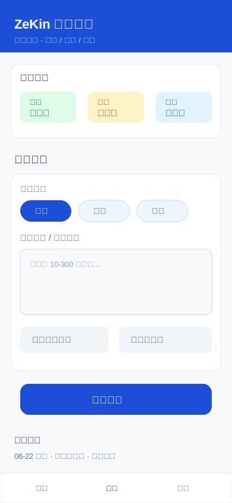
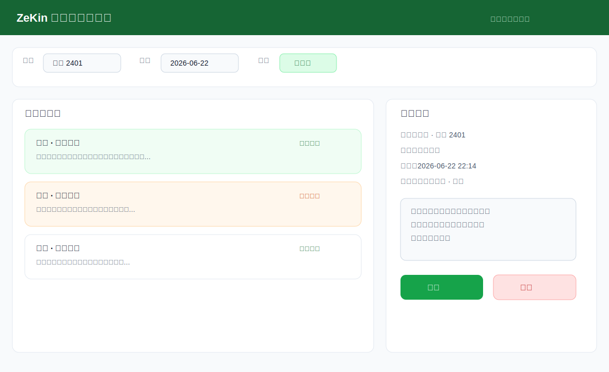
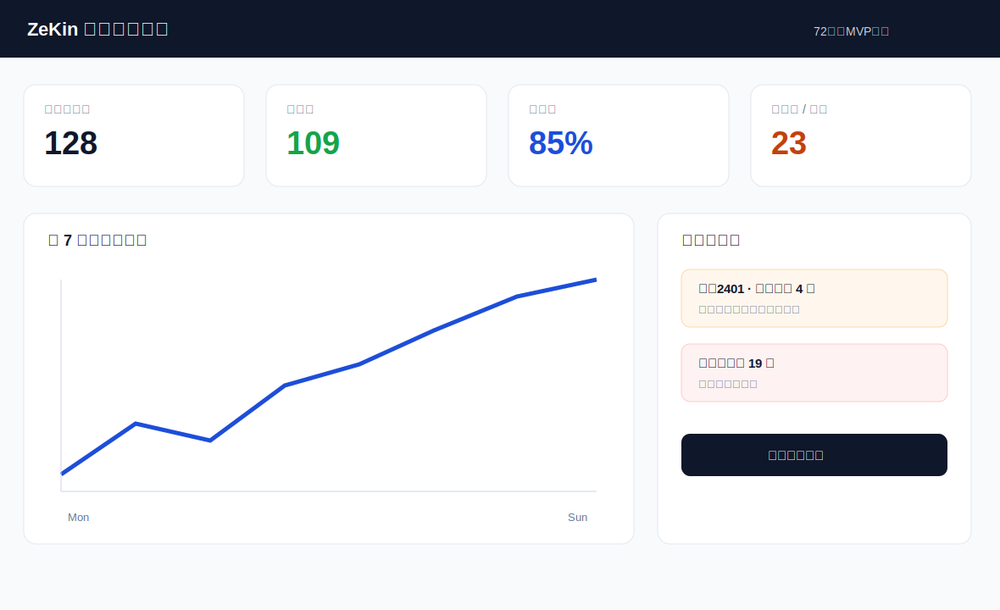

# ZeKin MVP 原型设计说明

## 1. 原型目标

本原型用于 72 小时 MVP 开发对齐，不追求视觉精装修，而追求信息结构清晰、关键路径明确、开发成本可控。

## 2. 样图

### 学生打卡页

设计要点：

- 首屏展示今日三类状态，减少学生判断成本。
- 打卡表单只保留类型、内容、定位、照片占位、提交按钮。
- 被驳回和待审核状态在历史记录中直接可见。

### 教师审核页

设计要点：

- 顶部固定筛选条件：班级、日期、类型、状态。
- 中部是待审核队列，优先处理异常和待审核。
- 右侧详情面板展示审核决策所需信息。

### 管理统计页

设计要点：

- 用指标卡片表达今日业务态势。
- 图表区域先做趋势占位，72 小时内优先保证统计数字准确。
- 异常列表引导管理员或教师回到审核工作。
