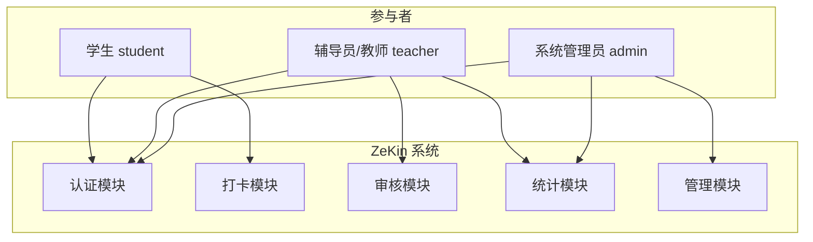

# ZeKin · AI 思政打卡系统 MVP 需求分析报告

| 属性 | 内容 |
|------|------|
| **项目名称** | ZeKin（AI 思政打卡与学生日常管理系统） |
| **文档版本** | V1.0 |
| **编制日期** | 2026-06-22 |
| **编制人** | 王韩韵（产品经理） |
| **审核人** | 赵耀、胡钊炫、华心仪 |
| **文档状态** | 正式版 · MVP 范围 |
| **技术栈** | Python · FastAPI · Vue 3 · MySQL 8.0 |

---

## 1. 文档说明

### 1.1 编写目的

本报告基于根目录现有需求材料（`需求分析.docx`、`AI思政打卡APP需求分析文档.docx`、`AI思政打卡APP项目投标书.docx`）进行整合、提炼与工程化落地，为 ZeKin MVP 提供：

- 清晰的产品边界与验收标准
- 规格驱动开发（Spec-Driven Development）的输入基线
- 四人团队模块划分与敏捷迭代计划
- 四环境（Local → Dev → UAT → Prod）验收路径

### 1.2 MVP 定义

**MVP（Minimum Viable Product）** 指在 47 天项目周期内，以最小可交付单元验证核心业务假设：

> 数字化打卡 + 教师审核 + 基础统计，能够替代 70% 以上人工查寝/考勤工作，并为后续 AI 审核、补签、通知等能力预留扩展接口。

本报告中的 **MCP** 若指「最小可行产品」，统一采用业界标准术语 **MVP**。

### 1.3 范围边界

| 纳入 MVP | 排除 MVP（后续版本） |
|----------|---------------------|
| 用户注册/登录（JWT） | 家长端 |
| 查寝/上课/实习三种打卡 | 语音打卡 |
| 打卡历史与今日状态 | 直播查寝 |
| 教师审核面板 | 人脸识别（Could，Sprint 3 视进度） |
| 班级打卡列表 | 第三方 OA 集成 |
| GPS 定位记录（Should：先记录后校验） | |
| AI 内容审核（Should，教师审核兜底） | |
| 基础统计与 Excel 导出（Should） | |
| 补签申请与审批（Should） | |
| 管理员：用户/地点/课程配置（Should） | |

---

## 2. 项目背景与目标

### 2.1 业务痛点

| 痛点 | 现状 | 影响 |
|------|------|------|
| 查寝靠人工 | 辅导员每晚逐间宿舍点名，约 1.5–2 小时/晚 | 效率低、易串通隐瞒、数据难追溯 |
| 上课考勤 | 纸质/口头签到，大班课占 10–15 分钟 | 代签难发现、无预警 |
| 实习管理 | 学生分散各地，动态难掌握 | 安全隐患、校企沟通成本高 |

### 2.2 产品定位

ZeKin **不是**简单签到工具，而是 **「到岗验证 + 内容合规 + 数据追溯 + 异常预警」** 四位一体的学生日常管理数字化方案。

### 2.3 量化目标（MVP 验收）

| 指标 | 目标值 | 测量方式 |
|------|--------|----------|
| 辅导员 nightly 查寝耗时 | 从 90min 降至 ≤15min | UAT 场景实测 |
| Must 功能完成率 | 100% | 需求跟踪矩阵 |
| Should 功能完成率 | ≥90% | Sprint Review |
| API P95 响应时间 | <500ms | JMeter / k6 |
| 代签率（试点班级） | 较基线下降（记录对比） | 运营数据 |

---

## 3. 用户角色与权限（RBAC）



| 角色 | ID | 核心诉求 | 数据权限 |
|------|-----|----------|----------|
| 学生 | ACT001 | 快速打卡、查历史、补签 | 仅本人 CRUD（打卡创建、历史只读） |
| 辅导员/教师 | ACT002 | 班级考勤、审核、导出 | 所管班级学生数据 R/W |
| 系统管理员 | ACT003 | 配置、全局统计、用户管理 | 全系统 R/W |

---

## 4. 功能需求（MoSCoW + 用户故事）

### 4.1 Must — MVP 生存线

| ID | 模块 | 用户故事 | 验收标准 |
|----|------|----------|----------|
| FR-M01 | 认证 | 作为用户，我想用手机号注册并登录，以便安全使用系统 | JWT 签发；密码 bcrypt 哈希；`/api/v1/auth/*` 可用 |
| FR-M02 | 打卡 | 作为学生，我想提交查寝/上课/实习打卡（文字+可选照片+GPS），以便完成日常任务 | 三种 type；同日同类型不可重复；内容 20–500 字 |
| FR-M03 | 打卡 | 作为学生，我想查看今日打卡状态与历史记录 | 首页展示三场景状态；历史分页列表 |
| FR-M04 | 审核 | 作为教师，我想按班级/日期查看打卡列表并审核通过/驳回 | 列表筛选；审核后状态更新；评语可选 |
| FR-M05 | 审核 | 作为学生，我想看到教师审核结果 | 历史记录展示 `teacher_status` |

### 4.2 Should — MVP 增强（Sprint 2 优先）

| ID | 模块 | 用户故事 | 验收标准 |
|----|------|----------|----------|
| FR-S01 | AI | 作为系统，打卡提交后自动调用 AI 审核内容合规 | AI 失败时降级为 `pending`，不阻塞打卡 |
| FR-S02 | 定位 | 作为系统，记录 GPS 并可配置白名单校验 | 先存 lat/lng；白名单可开关 |
| FR-S03 | 补签 | 作为学生，我想申请近 7 天内补签（月限 3 次） | 审批流完整；批准后生成补签记录 |
| FR-S04 | 统计 | 作为教师，我想查看班级打卡率并导出 Excel | 概览 API + 文件下载 |
| FR-S05 | 通知 | 作为学生，我想收到打卡提醒与审核结果 | 站内消息 MVP；推送为 Could |
| FR-S06 | 管理 | 作为管理员，我想配置用户、地点、课程、学期 | CRUD 后台页面 |

### 4.3 Could / Won't

| 优先级 | 功能 | 说明 |
|--------|------|------|
| Could | 打卡日历、积分体系、AI 写作提示 | Sprint 3 余量 |
| Could | 人脸识别 | 依赖第三方 SDK，非 MVP 阻塞项 |
| Won't | 家长端、语音打卡、直播查寝 | V2.0 规划 |

### 4.3 核心用例规约（节选）

#### UC001 · 提交查寝打卡

| 项 | 内容 |
|----|------|
| 参与者 | 学生 |
| 前置条件 | 已登录；时段 22:00–23:00（可配置）；当日未查寝打卡 |
| 主流程 | 选类型 → 获取 GPS → 输入心得 → 可选上传照片 → 提交 → 持久化 → 触发 AI（异步）→ 返回结果 |
| 异常 | 重复打卡 400；时段外 400；定位失败允许提交但标记 `location_anomaly` |
| 后置条件 | `checkins` 新增记录；`ai_status=pending` |

#### UC002 · 教师审核打卡

| 项 | 内容 |
|----|------|
| 参与者 | 教师 |
| 前置条件 | 已登录；有班级权限 |
| 主流程 | 选班级/日期 → 列表 → 详情 → 通过/驳回 + 评语 → 写 `reviews` → 更新 `teacher_status` |
| 异常 | 无权限 403；已审核 409 |

---

## 5. 非功能需求

| 类别 | 要求 | MVP 实现策略 |
|------|------|--------------|
| **性能** | API P95 <500ms；首屏 <2s | MySQL 索引；分页；静态资源 CDN/Nginx |
| **安全** | HTTPS、JWT、bcrypt、RBAC | FastAPI Depends + 角色装饰器；.env 密钥 |
| **可用性** | 99%（Prod） | Docker 健康检查；DB 每日备份 |
| **兼容性** | Chrome/Edge 90+；移动端 H5 适配 | Vue 响应式；Viewport 适配 |
| **可维护性** | 模块化、注释≥30%、OpenAPI 文档 | 前后端分离；`/docs` Swagger |
| **可观测性** | 结构化日志、错误追踪 | structlog + 请求 ID（Should） |

---

## 6. 数据需求

### 6.1 核心实体 ER

```
users 1──N checkins 1──N reviews
users 1──N makeup_requests
users 1──N courses (teacher)
allowed_locations ──校验──> checkins (GPS)
```

### 6.2 表清单

| 表名 | 说明 | 负责人 |
|------|------|--------|
| `users` | 用户与角色 | 赵耀 |
| `checkins` | 打卡记录 | 赵耀 |
| `reviews` | 审核记录 | 赵耀 |
| `courses` | 课程安排 | 赵耀 |
| `allowed_locations` | 打卡白名单 | 赵耀 |
| `makeup_requests` | 补签申请 | 赵耀 |
| `system_config` | 时段/学期配置 | 赵耀 |

详细 DDL 见 `specs/database/schema.sql`。

---

## 7. 接口需求（RESTful · OpenAPI 3.1）

**约定：**

- 前缀：`/api/v1`
- 响应：`{ "code": int, "message": str, "data": any }`
- 认证：`Authorization: Bearer <JWT>`

| 模块 | 方法 | 路径 | 权限 |
|------|------|------|------|
| Auth | POST | `/auth/register` | 公开 |
| Auth | POST | `/auth/login` | 公开 |
| Auth | GET | `/auth/me` | 登录 |
| Checkin | POST | `/checkins` | student |
| Checkin | GET | `/checkins` | student |
| Checkin | GET | `/checkins/today` | student |
| Teacher | GET | `/teacher/checkins` | teacher |
| Teacher | POST | `/teacher/reviews` | teacher |
| Stats | GET | `/stats/overview` | teacher/admin |
| Stats | GET | `/stats/export` | teacher/admin |
| Admin | CRUD | `/admin/users` `/admin/locations` `/admin/courses` | admin |

完整契约：`specs/openapi.yaml`（规格驱动开发单一事实来源）。

---

## 8. 界面与交互（信息架构）

### 8.1 学生端（华心仪 · Vue H5 响应式）

```
/login, /register
/app
  ├── /home        今日状态 + 最近记录
  ├── /checkin     类型切换 + 表单 + 定位 + 拍照
  └── /profile     个人信息 + 补签入口 + 统计
```

### 8.2 教师/管理端（胡钊炫 · Vue3 + Element Plus）

```
/teacher/dashboard   班级概览
/teacher/review      审核列表 + 详情抽屉
/teacher/stats       图表 + 导出
/admin/*             用户/地点/课程/系统配置
```

线框参考根目录 `需求分析.docx` 第 10 章。

---

## 9. 技术架构（2026 最佳实践）

```
┌─────────────────────────────────────────────────────────┐
│  Client Layer                                           │
│  ┌──────────────────┐  ┌──────────────────────────┐  │
│  │ student-web (Vue)│  │ admin-web (Vue3+Element+) │  │
│  │ 华心仪            │  │ 胡钊炫                     │  │
│  └────────┬─────────┘  └────────────┬─────────────┘  │
└───────────┼─────────────────────────┼─────────────────┘
            │         HTTPS / REST     │
┌───────────▼─────────────────────────▼─────────────────┐
│  API Layer — FastAPI (赵耀)                           │
│  auth │ checkin │ review │ stats │ admin │ ai_worker  │
└───────────┬───────────────────────────────────────────┘
            │
┌───────────▼───────────────────────────────────────────┐
│  Data Layer                                           │
│  MySQL 8.0 │ 本地文件存储 uploads/ │ Redis (Should)   │
└───────────────────────────────────────────────────────┘
```

**规格驱动开发流程：**

1. 王韩韵在 `specs/features/` 编写 Feature Spec（Given-When-Then）
2. 赵耀更新 `specs/openapi.yaml` → 生成/校验后端路由
3. 前后端依据 OpenAPI 并行开发；契约变更走 PR Review
4. Agent 辅助：Cursor/Claude 以 `specs/` 为上下文生成代码，禁止偏离契约

---

## 10. 团队模块划分

| 成员 | 角色 | 负责模块 | Git 分支前缀 |
|------|------|----------|--------------|
| **王韩韵** | PO / QA / 项目经理 | 需求、验收、测试用例、Sprint 仪式 | `docs/*`, `specs/features/*` |
| **赵耀** | 后端 + DevOps | `backend/`, DB, AI 对接, CI/CD, 部署 | `feat/backend-*` |
| **胡钊炫** | Web 管理端 | `frontend/admin/`, 教师审核、统计、管理后台 | `feat/admin-*` |
| **华心仪** | 学生端 | `frontend/student/`, 打卡 UX、移动端适配 | `feat/student-*` |

详见 `docs/team-module-division.md`。

---

## 11. 敏捷开发计划（Scrum · 47 天）

| Sprint | 周期 | 目标 | 环境里程碑 |
|--------|------|------|------------|
| **S0** | D1–D7 | 需求冻结、OpenAPI、DDL、原型确认 | Local 环境就绪 |
| **S1** | D8–D21 | Must 全量：认证+打卡+审核 | Dev 服务器首次部署 |
| **S2** | D22–D35 | Should：AI、统计、补签、管理 | UAT 环境部署 |
| **S3** | D36–D42 | 测试、性能、安全、Bug 修复 | UAT 验收 |
| **S4** | D43–D47 | Prod 部署、培训、验收报告 | **生产环境** 上线 |

每日 15min Standup · 周五 Review + Retro · Git Flow：`main` ← `develop` ← `feat/*`

---

## 12. 四环境验收策略

| 环境 | 用途 | 分支/触发 | 验收负责人 |
|------|------|-----------|------------|
| **Local** | 个人开发联调 | 本地 docker-compose | 各开发 |
| **Dev** | 集成测试、演示 | push `develop` | 赵耀 |
| **UAT** | 用户验收、培训 | tag `v*-rc*` | 王韩韵 + 甲方 |
| **Prod** | 正式上线 | tag `v*` + 人工审批 | 王韩韵 |

详见 `docs/environment-strategy.md`。

---

## 13. 需求跟踪矩阵（RTM）

| 需求 ID | 优先级 | 后端 | 学生端 | 管理端 | 测试用例 |
|---------|--------|------|--------|--------|----------|
| FR-M01 | Must | ✓ | ✓ | ✓ | TC-AUTH-01~05 |
| FR-M02 | Must | ✓ | ✓ | — | TC-CK-01~08 |
| FR-M03 | Must | ✓ | ✓ | — | TC-CK-09~10 |
| FR-M04 | Must | ✓ | — | ✓ | TC-REV-01~06 |
| FR-M05 | Must | ✓ | ✓ | — | TC-REV-07 |
| FR-S01 | Should | ✓ | — | — | TC-AI-01~03 |
| FR-S03 | Should | ✓ | ✓ | ✓ | TC-MK-01~05 |
| FR-S04 | Should | ✓ | — | ✓ | TC-STAT-01~04 |

---

## 14. 风险与应对

| 风险 | 概率 | 影响 | 应对 |
|------|------|------|------|
| AI API 不稳定 | 中 | 中 | 异步审核 + 教师兜底；Feature Flag |
| GPS 室内精度差 | 高 | 中 | MVP 先记录不强制；白名单可选 |
| 四人并行接口冲突 | 中 | 高 | OpenAPI 契约优先；每日联调 |
| GitHub/部署网络 | 中 | 中 | 镜像源 + 内网 Dev 机 |

---

## 15. 验收标准（MVP 签字项）

- [ ] 全部 **Must** 功能通过 UAT 测试用例
- [ ] **Should** 功能完成率 ≥90%
- [ ] OpenAPI 文档与实现一致（Schemathesis 或手工对账）
- [ ] 四环境部署文档可复现
- [ ] 源代码已 push 至 `origin/main`，含 README 与 specs
- [ ] 交付：用户手册、部署手册、测试报告、验收报告

---

## 16. 附录

| 文档 | 路径 |
|------|------|
| 团队分工 | `docs/team-module-division.md` |
| 敏捷计划 | `docs/agile-sprint-plan.md` |
| 环境策略 | `docs/environment-strategy.md` |
| OpenAPI 契约 | `specs/openapi.yaml` |
| 数据库 DDL | `specs/database/schema.sql` |
| Feature Spec 模板 | `specs/features/_template.md` |

---

**变更记录**

| 版本 | 日期 | 作者 | 说明 |
|------|------|------|------|
| V1.0 | 2026-06-22 | 王韩韵 | MVP 初版，技术栈调整为 FastAPI + Vue |
