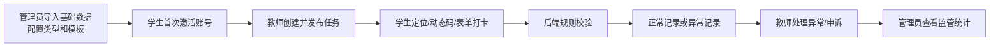

# AI思政辅助APP三端平台实现方案

本方案面向“毕业设计/论文可讲清楚，同时工程上具备产品化扩展空间”的实现目标。系统第一阶段采用模块化单体架构，优先打通管理员配置、教师发布、学生打卡、异常申诉、监管统计的业务闭环。

## 设计结论

- 后端采用 FastAPI，使用 uv 管理 Python 项目和依赖。
- 数据库采用 Docker PostgreSQL；SQLAlchemy 负责 ORM/数据访问，Alembic 负责数据库迁移版本管理。
- 管理员端采用 Vue3 + Vite + Element Plus。
- 学生端和教师端先采用同一个 uni-app 项目，通过角色区分页面和导航，再构建到微信小程序。
- 第一阶段真实接入定位；微信订阅消息做 provider 适配；人脸识别只做占位适配器和数据结构预留，暂不作为第一阶段验收项。
- 学生账号采用“管理员先导入学生名单，学生首次登录激活绑定”的方式。
- API 验收测试使用 Bruno，代码级自动化测试使用 pytest。

## 分层文档

1. [架构与模块边界](2026-06-24-ai-sizheng-platform/01-architecture.md)
2. [数据库与核心数据模型](2026-06-24-ai-sizheng-platform/02-data-model.md)
3. [规则引擎与真实接入边界](2026-06-24-ai-sizheng-platform/03-rule-engine-integrations.md)
4. [三端第一阶段落地范围](2026-06-24-ai-sizheng-platform/04-client-scope.md)
5. [后端 API 与前端目录结构](2026-06-24-ai-sizheng-platform/05-api-and-structure.md)
6. [测试、Bruno 验收与里程碑](2026-06-24-ai-sizheng-platform/06-testing-and-milestones.md)

## 第一阶段主链路

第一阶段完成后，系统应能演示一条完整业务路径：管理员导入软件学院学生和教师，配置晚间查寝模板；学生用学号和手机号激活；教师选择班级发布查寝任务；学生在小程序真实定位并提交打卡；系统判断正常或异常；学生可提交申诉；教师审核；管理员查看任务完成率和异常情况。

## 范围控制

第一阶段包含：

- 管理员基础数据、打卡类型、规则模板、任务监管、异常监管。
- 教师任务创建、任务详情、班级查看、异常处理。
- 学生激活登录、任务列表、打卡提交、异常申诉、消息、我的档案。
- PostgreSQL 数据持久化、任务规则快照、真实定位校验、Bruno API 验收集合。

第一阶段暂缓：

- 复杂权限体系和导出审批。
- 完整数据大屏和长期画像。
- 真实人脸识别服务接入。
- 复杂 AI 风险模型。
- 微服务拆分。
