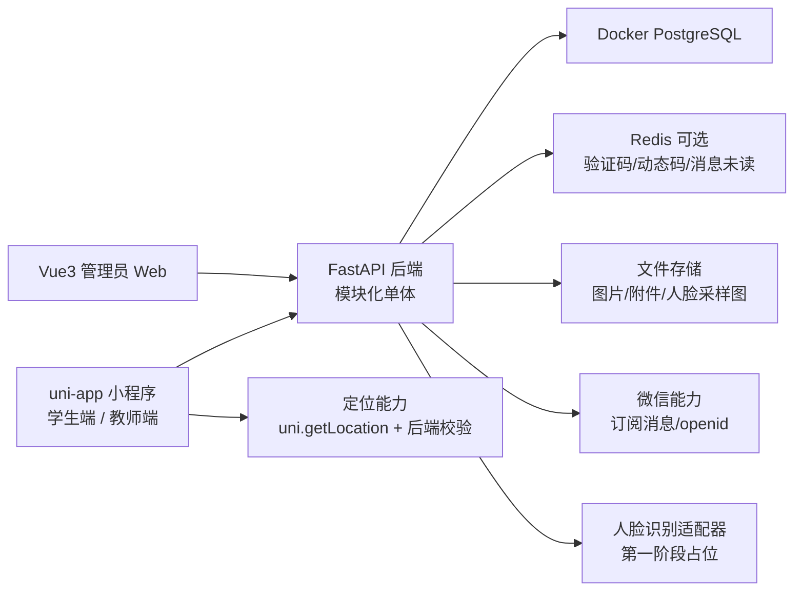

# 01 架构与模块边界

## 总体架构

系统采用“三端一后端”的模块化单体架构。第一阶段不拆微服务，避免部署、事务和联调复杂度过高；后端内部通过清晰模块边界保持可扩展性。

## 技术栈

- 后端：FastAPI、uv、SQLAlchemy、Alembic、Pydantic、pytest。
- 数据库：Docker PostgreSQL。
- 管理端：Vue3、Vite、Element Plus。
- 小程序端：uni-app，先统一承载学生端和教师端，再构建到微信小程序。
- API 验收：Bruno。

PostgreSQL 是实际数据库；SQLAlchemy 是 Python 访问 PostgreSQL 的 ORM 和查询层；Alembic 是 PostgreSQL 表结构迁移管理工具；uv 管理 Python 项目依赖和命令运行。

## 后端模块

- `auth`：手机号/学号登录、学生首次激活、教师/管理员登录、微信 openid 绑定预留。
- `identity`：用户、学生档案、教师档案、管理员档案、组织树。
- `groups`：行政班、课程班、实习小组、活动分组、自定义分组。
- `checkin_types`：管理员维护打卡类型。
- `rule_templates`：规则模板和版本。
- `tasks`：教师创建任务、发布、结束、规则快照。
- `records`：学生提交打卡、定位/动态码/表单结果、状态判定。
- `exceptions`：异常记录、申诉、教师审核闭环。
- `messages`：站内消息、微信订阅消息适配。
- `statistics`：教师和管理员首页概览、基础统计。
- `integrations`：微信、短信验证码、定位校验、人脸识别占位、文件上传等外部能力适配器。

## 关键架构原则

1. **模块化单体优先**
   先保证主链路稳定，避免第一阶段被微服务治理拖慢。模块边界通过包结构、服务层和 repository 层表达。

2. **规则驱动任务**
   系统不把查寝、课堂、实习写死为固定功能，而是用打卡类型、规则模板和任务规则快照扩展场景。

3. **第三方能力适配器隔离**
   微信消息、定位、人脸、文件存储都通过 provider/service 封装。真实服务变化不应影响任务和记录主流程。

4. **三端职责分离**
   管理员管基础数据、规则和监管；教师管任务和异常；学生管打卡、申诉和个人档案。

5. **第一阶段不强化复杂权限**
   保留角色字段和数据范围字段，但不把细粒度权限、导出审批、敏感数据审计作为第一阶段重点。
