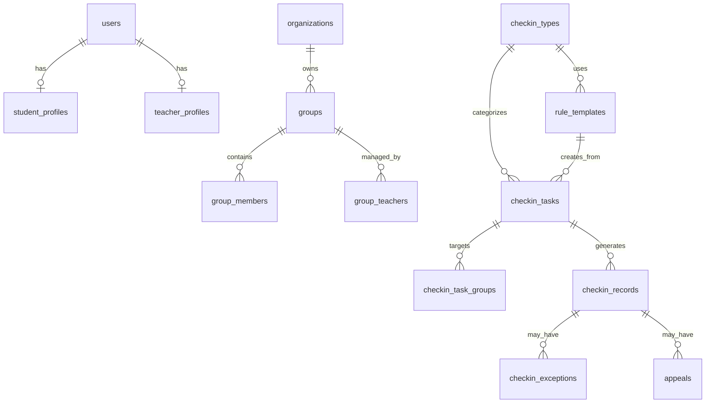

# 02 数据库与核心数据模型

## 数据库选择

第一阶段使用 Docker PostgreSQL。规则配置、动态表单、任务规则快照等扩展字段使用 PostgreSQL 的 `JSONB`，既便于保存灵活配置，也保留后续结构化查询空间。

## 核心关系



## 核心表

### 账号与档案

- `users`：统一账号表。字段包括账号、手机号、密码哈希、用户类型、状态、最近登录时间、`wechat_openid` 预留。
- `student_profiles`：学生档案。字段包括学号、姓名、学院、专业、年级、行政班、宿舍、实习单位、当前状态、激活状态。
- `teacher_profiles`：教师档案。字段包括工号、姓名、院系、教师角色、联系方式。
- `admin_profiles`：管理员档案。字段包括部门、管理范围、管理员类型。
- `organizations`：组织树。承载学校、学院、专业、年级、班级等层级。

### 分组

- `groups`：统一分组表。通过 `group_type` 区分行政班、课程班、实习小组、活动分组、自定义分组。
- `group_members`：学生与分组关系。
- `group_teachers`：教师与分组关系。

统一分组建模可以避免行政班、课程班、实习小组各写一套任务发布逻辑。教师创建任务时只选择一个或多个 group。

### 类型、模板、任务

- `checkin_types`：打卡类型，如查寝、课堂、实习、活动、早操、返校、安全上报、自定义。
- `rule_templates`：规则模板。字段包括模板名称、模板类型、适用打卡类型、适用组织、创建人、状态、使用次数、`rules_jsonb`。
- `rule_template_versions`：模板版本，可在第二阶段启用。第一阶段可只保留模板更新时间和规则内容。
- `checkin_tasks`：教师发布的任务。核心字段包括任务名称、说明、打卡类型、发布教师、任务状态、开始/结束时间、是否周期任务、是否通知、`rules_snapshot_jsonb`。
- `checkin_task_groups`：任务面向的分组。
- `checkin_task_students`：任务面向的学生明细或排除名单。

任务发布时必须保存 `rules_snapshot_jsonb`。后续模板修改不能影响已发布任务，否则历史统计和申诉依据会不稳定。

### 记录、异常、申诉

- `checkin_records`：学生打卡记录。保存任务、学生、提交时间、状态、经纬度、定位校验结果、动态码校验结果、人脸占位结果、提交内容 `submit_payload_jsonb`、系统判定结果。
- `checkin_record_attachments`：图片、附件、人脸采样图等文件引用。
- `checkin_exceptions`：异常记录。异常类型包括未打卡、超时、定位异常、动态码错误、人脸失败占位、安全风险、日志未提交、申诉待审核。
- `appeals`：学生申诉或补充说明。
- `review_logs`：教师审核记录。
- `messages`：站内消息和微信订阅消息发送记录。
- `audit_logs`：轻量记录关键操作，第一阶段用于演示和追踪，不做复杂审计。

## 学生账号激活

管理员先导入学生名单，写入 `student_profiles`，初始状态为未激活。学生首次使用小程序时输入姓名、学号、手机号、验证码并设置密码。后端匹配已导入档案后创建或绑定 `users` 账号，并把档案标记为已激活。

小程序部署后，学生可绑定微信 `openid`。`openid` 主要用于微信订阅消息和微信身份关联，不替代学校账号体系。

## JSONB 规则示例

```json
{
  "timeRule": {
    "mode": "single",
    "startTime": "21:30",
    "endTime": "22:30",
    "allowLate": false,
    "allowMakeup": true,
    "makeupNeedReview": true
  },
  "locationRule": {
    "mode": "fixed_area",
    "placeName": "3号宿舍楼",
    "longitude": 120.000001,
    "latitude": 30.000001,
    "radius": 300,
    "allowExceptionSubmit": true
  },
  "verificationRule": {
    "methods": ["location", "dynamic_code"]
  },
  "submitRule": {
    "fields": [
      {
        "key": "remark",
        "label": "情况说明",
        "type": "textarea",
        "required": false
      }
    ]
  },
  "reviewRule": {
    "mode": "exception_only"
  },
  "reminderRule": {
    "beforeStartMinutes": 10,
    "beforeEndMinutes": 5,
    "notifyTeacherAfterEnd": true
  },
  "faceRule": {
    "enabled": false,
    "provider": "placeholder"
  }
}
```
