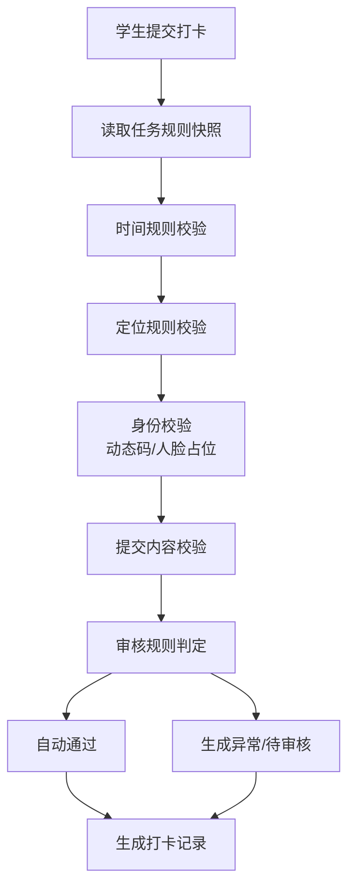

# 03 规则引擎与真实接入边界

## 规则执行方式

第一阶段不引入独立规则引擎，采用“规则 JSONB + 后端 evaluator 策略类”。教师发布任务后，任务保存规则快照；学生提交打卡时，后端只读取任务快照并逐项校验。



## Evaluator 划分

- `TimeRuleEvaluator`：判断是否在打卡时间内、是否迟到、是否允许补卡。
- `LocationRuleEvaluator`：校验学生提交经纬度是否在有效半径内。
- `DynamicCodeEvaluator`：校验教师任务动态码。可用 Redis 存短期有效码。
- `FaceRuleEvaluator`：第一阶段仅占位，默认关闭；启用时返回模拟结果或未配置结果。
- `SubmitRuleEvaluator`：校验文字、图片、实习日志、安全状态等动态表单字段。
- `ReviewRuleEvaluator`：决定自动通过、异常待审核、补卡待审核、申诉待审核。

Evaluator 返回统一结果：

```json
{
  "passed": false,
  "status": "exception",
  "exceptionTypes": ["location_error"],
  "messages": ["当前位置不在有效范围内"],
  "needReview": true
}
```

## 定位真实接入

学生端使用 `uni.getLocation` 获取经纬度。后端用 Haversine 算法计算提交位置与任务地点的距离，并与规则中的 `radius` 比较。

第一阶段不引入 PostGIS。只有当后续出现大量地点、复杂地理围栏、空间查询需求时，再引入 PostGIS。

定位异常处理：

- 未授权或获取失败：允许学生提交说明，记录为待审核。
- 超出半径：生成定位异常。
- 在半径内：定位校验通过。

## 微信消息接入

消息分两层：

1. 站内消息：写入 `messages` 表，学生和教师端可查看。
2. 微信订阅消息：通过 `WechatMessageProvider` 发送。

开发阶段 provider 可以运行在日志模式，只记录请求参数和模拟发送结果。部署到微信小程序后配置 `appid`、`secret`、模板 ID，再切换为真实发送。

## 人脸识别占位

人脸识别第一阶段不做真实实现，不作为打卡通过的硬依赖。系统只预留三部分：

- 规则结构：`faceRule.enabled`、`faceRule.provider`、阈值字段预留。
- 后端接口：`FaceProvider.verify(student_id, image)`。
- 记录字段：保存人脸校验状态、置信度、采样图附件引用。

前端可保留人脸入口，但默认由规则控制为关闭。后续确定腾讯云、阿里云、百度云或本地服务后，只替换 provider，不改任务发布、打卡记录和异常处理主流程。

## 文件上传

第一阶段文件可以存本地目录或 Docker volume，数据库保存文件 URL/路径、文件类型、关联记录。后续替换对象存储时，通过 `FileStorageProvider` 屏蔽差异。

## 登录与激活

学生登录以学校账号为主：

- 首次激活：姓名、学号、手机号、验证码、密码。
- 后续登录：学号/手机号 + 密码，或手机号 + 验证码。
- 微信绑定：保存 `openid`，用于订阅消息和身份关联。

教师和管理员账号由管理员创建，第一阶段使用账号/手机号 + 密码登录。
