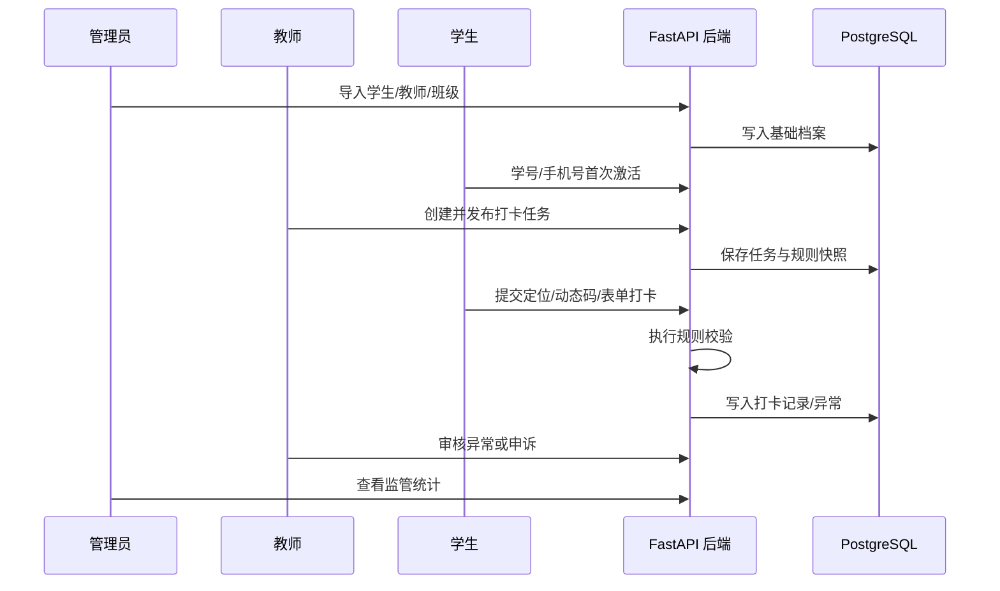

# 06 测试、Bruno 验收与里程碑

## 测试策略

第一阶段测试重点是主链路和规则可扩展性。

后端测试：

- 单元测试：规则 evaluator，例如时间、定位、动态码、审核规则。
- 接口测试：登录激活、教师发任务、学生打卡、异常审核。
- 数据测试：任务发布后规则快照不受模板修改影响。
- 集成测试：使用 Docker PostgreSQL 跑一条完整业务链路。

前端测试：

- 管理端：表单校验、导入流程、规则模板编辑。
- 小程序端：登录激活、定位授权失败、任务提交、异常申诉。
- 手工验收：使用管理员、教师、学生账号走完整流程。

## Bruno API 验收

API 验收测试使用 Bruno，作为接口联调、演示和回归资产。建议目录：

```text
test/
  bruno/
    AI-Sizheng-Platform/
      bruno.json
      collection.bru
      environments/
        local.bru
      Auth/
      Admin/
      Teacher/
      Student/
      Checkin/
      Exceptions/
      Statistics/
```

建议 Bruno 集合按业务顺序组织：

1. 管理员登录。
2. 导入学生、教师、班级。
3. 学生首次激活。
4. 教师登录。
5. 创建并发布任务。
6. 学生查询任务。
7. 学生提交打卡。
8. 教师查看异常。
9. 学生提交申诉。
10. 教师审核申诉。
11. 管理员查看监管统计。

Bruno 负责接口验收和演示，pytest 负责代码层面的自动化验证。

## 验收主流程



验收标准：

- 管理员能维护基础数据、打卡类型和规则模板。
- 学生能完成首次激活并登录。
- 教师能基于模板发布任务。
- 学生能真实定位提交打卡。
- 后端能判定正常或异常。
- 教师能处理异常和申诉。
- 管理员能看到任务完成率和异常情况。
- 人脸识别为占位能力，不影响第一阶段验收。

## 里程碑

### 里程碑 1：工程骨架与基础设施

交付：

- FastAPI + uv + SQLAlchemy + Alembic。
- Vue3 + Vite + Element Plus。
- uni-app 项目骨架。
- Docker PostgreSQL，Redis 可选。
- 统一配置、接口响应、错误处理、基础日志。

验收：

- 后端 `/health` 可访问。
- PostgreSQL 容器可连接。
- 管理端和小程序可调用后端测试接口。

### 里程碑 2：账号、组织、用户、分组

交付：

- 管理员/教师登录。
- 管理员导入学生名单。
- 学生首次激活账号。
- 组织树。
- 学生/教师管理。
- 班级与分组管理。
- 教师关联分组。

验收：

- 管理员能导入学生。
- 学生能用学号/手机号激活并登录。
- 教师能看到自己管理的班级/分组。

### 里程碑 3：打卡类型与规则模板

交付：

- 打卡类型管理。
- 规则模板管理。
- 规则 JSONB 结构。
- 教师端可选择可用类型和模板。
- 人脸规则仅作为 disabled/placeholder 配置项。

验收：

- 管理员能配置课堂签到、晚间查寝等模板。
- 教师创建任务时能直接使用模板。

### 里程碑 4：教师发布任务

交付：

- 教师创建任务分步表单。
- 选择班级或分组。
- 选择打卡类型和规则模板。
- 任务规则快照。
- 发布、结束、查看任务。

验收：

- 教师发布任务后，学生端能看到待打卡任务。
- 修改模板不影响已发布任务。

### 里程碑 5：学生真实定位打卡

交付：

- 学生任务详情。
- `uni.getLocation` 获取定位。
- 后端距离校验。
- 动态码校验。
- 动态提交表单。
- 打卡记录生成。
- 正常、迟到、定位异常状态判定。

验收：

- 学生能完成一次真实定位打卡。
- 超出范围或超时能生成异常记录。
- 教师端任务详情能看到完成率变化。

### 里程碑 6：异常、申诉、消息

交付：

- 异常列表。
- 学生申诉。
- 教师审核通过、驳回、要求补充。
- 站内消息。
- 微信订阅消息 provider，占位或开发配置发送。

验收：

- 异常打卡能进入教师待处理。
- 教师处理后学生能看到结果消息。
- 消息发送记录可追踪。

### 里程碑 7：监管与基础统计

交付：

- 管理员任务监管。
- 管理员异常与申诉监管。
- 教师首页统计。
- 学生我的/成长概览。
- 基础数据统计接口。

验收：

- 管理员能看到任务整体完成情况和异常情况。
- 教师能看到班级任务完成率。
- 学生能查看个人记录和简单成长概览。

## 答辩表达重点

项目可以概括为：

> 本系统基于 FastAPI、Vue3、uni-app 和 PostgreSQL 构建面向高校思政管理的三端协同平台，通过可配置打卡类型、规则模板和任务规则快照，实现多场景学生打卡管理。系统以管理员端配置治理、教师端任务发布与异常处理、学生端打卡执行与个人档案为主线，形成“基础数据管理—任务发布—学生执行—异常申诉—统计监管”的闭环流程。

可讲亮点：

- 可配置任务模型。
- 任务规则快照。
- 统一分组模型。
- 三端协同。
- 真实定位接入。
- 人脸识别适配器占位，便于后续真实服务接入。
