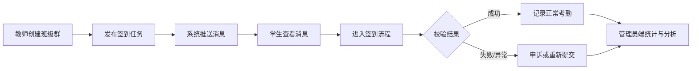

# 知勤（Zekin）项目介绍

---

## 1. 项目定位

**知勤（Zekin）** 是一套面向 **高校学生考勤打卡** 场景的数字化管理系统。系统以微信小程序为主要交互载体，配合 Web 管理端，帮助学校完成 **签到发布 → 消息触达 → 学生打卡 → 异常处理 → 数据统计** 的完整闭环。

产品采用「**班级群组 + 可组合签到方式**」模型：无论是查寝、课堂点名还是实习签到，本质都是 **教师向班级群发布任务，学生在规定时间与规则内完成签到**，差异仅体现在签到方式与时间配置，而非多套独立业务系统。

---

## 2. 系统组成

| 端 | 形态 | 主要用户 | 核心能力 |
|----|------|----------|----------|
| **管理员端** | Web（Vue 3） | 教务管理员、辅导员 | 组织与人员管理、任务与异常监管、**数据可视化与分析**、信息导出 |
| **教师端** | 微信小程序 | 任课教师、班导师 | 创建班级群、发布签到任务、选择签到方式与时间、查看考勤与处理异常 |
| **学生端** | 微信小程序 | 在校学生 | 接收签到消息、查看任务说明、完成签到、查看记录、申诉或重新提交 |

后端采用 **FastAPI** 提供统一 API，负责身份认证、任务发布、消息推送、签到校验与数据统计。

---

## 3. 核心业务闭环



### 3.1 教师端：发布签到

教师登录小程序后，可完成以下操作：

1. **创建与管理班级群** — 建立课程班、宿舍班、实习班等群组，邀请或管理学生成员。
2. **发布签到任务** — 通过 **查寝 / 课堂 / 实习** 等场景快捷入口一键预设规则，选择目标 **班级群**，配置 **签到方式**（可单选或组合）与 **签到时间范围**，填写任务说明后发布。
3. **任务通知** — 任务发布后，系统自动向群内学生 **发送消息提醒**，消息中包含任务名称、课群、签到方式与时间等关键信息。
4. **现场辅助** — 支持二维码投屏签到、查看学生打卡进度、手动调整考勤状态、处理异常与申诉。

### 3.2 学生端：接收消息与签到

学生登录小程序后，典型流程如下：

1. **接收消息** — 在「消息」页收到教师发布的签到提醒。
2. **查看详情** — 进入消息详情，查看 **任务名称、课群名称、发送时间、任务说明**，以及签到方式、地点与时间要求。
3. **去签到** — 点击「去签到」进入打卡流程，按任务配置逐步完成人脸、定位、扫码、附件等校验步骤。
4. **结果处理** — 签到成功后可在记录中查看；若签到失败或被判为异常，可选择 **提交申诉** 说明情况，或 **返回重新提交** 打卡。

### 3.3 管理员端：监管与分析

管理员通过 Web 端登录后，可进行全局管理与数据分析：

- **首页概览** — 学生规模、任务数量、完成率、异常与待处理申诉等核心指标。
- **组织与人员** — 学院/专业/班级组织树，学生与教师账号管理、批量导入。
- **班级与任务监管** — 查看各班级群组、考勤任务运行状态与打卡记录。
- **异常与申诉管理** — 集中处理异常打卡与学生申诉。
- **数据可视化** — 任务状态分布、完成率趋势、异常类型、班级对比等图表展示；配套 **数据大屏** 便于汇报展示。
- **信息导出** — 支持将考勤统计、人员与任务相关数据导出，便于教务归档与报表制作。

---

## 4. 支持的签到方式

教师发布任务时可 **自由勾选、自由组合** 以下签到方式（至少选择一种）：

| 方式 | 说明 | 典型场景 |
|------|------|----------|
| **人脸识别** | 拍照并与注册人脸比对 | 查寝、课堂、实习身份核验 |
| **地理位置** | GPS 定位 + 地理围栏校验 | 到场签到、宿舍查寝 |
| **二维码签到** | 扫描教师端动态二维码 | 课堂点名、防代签 |
| **附件/日志** | 上传文字、图片或文件 | 实习日报、情况说明 |
| **手势签到** | 绘制指定手势图案 | 快速点名、轻量签到 |

系统始终校验 **签到时间窗口**；启用的各项方式均通过后，打卡才算成功。

---

## 5. 典型应用场景

| 场景 | 班级群示例 | 常见签到组合 | 时间特点 |
|------|------------|--------------|----------|
| 晚间查寝 | 3 号寝室班 | 人脸 + 定位 | 每日固定时段 |
| 课堂签到 | 高等数学 A 班 | 二维码 + 人脸 | 课前 15 分钟 |
| 实习打卡 | XX 公司实习班 | 人脸 + 定位 + 附件 | 每日上班时段 |

三类场景共用同一套任务与校验引擎，仅配置不同，无需维护多套业务代码。

---

## 6. 常用场景快捷入口

为降低教师配置成本、提升发布效率，知勤针对 **查寝、课程、实习** 等高校高频场景提供 **一键预设 + 快捷入口**，教师无需从零填写规则，选中场景后系统自动带入推荐模板，仍可在此基础上微调。

### 6.1 教师端：场景快捷创建

教师在小程序 **「发起签到」** 页面顶部，可通过场景卡片快速切换：

| 快捷入口 | 适用场景 | 默认签到组合 | 默认说明 |
|----------|----------|--------------|----------|
| **课堂签到** | 课前点名、活动到场 | 定位 + 人脸 | 教室签到点、一次任务 |
| **查寝打卡** | 晚间归寝、宿舍安全 | 定位 + 人脸 | 宿舍签到点，可设为每日循环 |
| **实习打卡** | 校外实习、岗位实践 | 定位 + 附件/日志 | 附带「今日工作日志」提交 |

选择场景后，系统自动填充 **模板名称、签到方式、地点名称** 等默认值；教师只需补充 **班级群、时间范围、任务标题** 即可完成发布。三步向导（任务设置 → 规则设置 → 确认发布）进一步简化操作流程。

教师首页还提供 **发起签到、考勤管理、班级管理、审核管理** 等快捷工具栏，从首页一键进入对应能力。

### 6.2 管理员端：场景规则模板

管理端预置与上述场景对应的 **规则模板**，供教师复用或管理员统一维护：

| 模板名称 | 对应场景 | 签到组合 |
|----------|----------|----------|
| 晚间查寝模板（人脸+位置） | 查寝 | 人脸 + 定位 |
| 课程签到模板（二维码+人脸） | 课程 | 二维码 + 人脸 |
| 实习日报模板（人脸+位置+附件） | 实习 | 人脸 + 定位 + 附件 |

管理员可在 Web 端统一配置组织、人员与模板，保证各学院场景规则一致、便于监管与导出。

### 6.3 学生端：按场景筛选任务

学生在 **「打卡任务」** 页可按类型快速筛选，对应不同使用场景：

| 筛选标签 | 涵盖场景 |
|----------|----------|
| 日常任务 | 查寝、晚间打卡等 |
| 课堂类 | 课程签到、上课点名 |
| 实习类 | 实习打卡、日报提交 |
| 活动类 | 班团活动、会议签到等 |

学生从 **消息详情** 点击「去签到」，或从任务列表按场景找到待办，均可快速进入打卡流程。

### 6.4 设计说明

快捷入口 **不改变底层业务模型** — 查寝、课程、实习仍统一为「班级群 + 打卡任务 + 可组合签到方式」。场景入口只是 **预设配置的快路径**，避免教师重复设置相同规则，同时保留完全自定义能力，满足特殊考勤需求。

---

## 7. 技术架构概览

```
┌─────────────────────────────────────────────────────────┐
│                      知勤 Zekin                          │
├──────────────┬──────────────────────┬───────────────────┤
│  admin-web   │      mini-app          │     backend       │
│  管理端 Web   │  教师端 / 学生端小程序   │   FastAPI 后端     │
│  Vue3 + EP   │  uni-app + 微信        │   校验流水线 + DB   │
└──────────────┴──────────────────────┴───────────────────┘
```

| 目录 | 说明 |
|------|------|
| `admin-web/` | 管理员 Web 端，数据看板、组织人员、异常申诉、数据大屏 |
| `mini-app/` | 微信小程序，教师发布签到 / 学生打卡与消息 |
| `backend/` | API 服务、任务发布通知、CheckinPipeline 签到校验 |
| `docs/` | 设计文档、API 说明、项目介绍 |

---

## 8. 产品特点

1. **一端发布，全员触达** — 教师发布任务后，学生通过消息即时获知，减少漏签。
2. **场景快捷入口** — 查寝、课程、实习等常用场景一键预设，降低配置成本。
3. **规则可配置** — 签到方式、时间、围栏、二维码刷新策略等均可按任务灵活配置。
4. **流程可闭环** — 从签到、异常、申诉到管理员审核，形成完整处理链路。
5. **数据可感知** — 管理端图表与大屏让考勤情况一目了然，支撑决策与导出。
6. **架构可扩展** — 签到方式以插件化 Verifier 实现，新增方式无需改动核心流程。

---

## 9. 本地体验（开发环境）

```powershell
# 后端 API
cd backend
python -m uvicorn app.main:app --host 0.0.0.0 --port 8000

# 管理员 Web
cd admin-web
npm run dev
# 默认 http://localhost:5173 或 5174

# 小程序（微信开发者工具导入 mini-app/dist/dev/mp-weixin）
cd mini-app
npm run dev:mp-weixin
```

**演示账号（seed 数据）：**

| 角色 | 账号 | 密码 |
|------|------|------|
| 管理员 | `admin` | `123456` |
| 教师 | `20261001` | `123456` |
| 学生 | 按 seed 学号激活 | `123456` |

---

## 10. 相关文档

- [打卡任务系统设计方案（完整版）](./checkin-task-template-design.md) — 领域模型、校验流水线与 API 设计细节

---

**知勤 Zekin — 让高校考勤更及时、更透明、更好管。**
